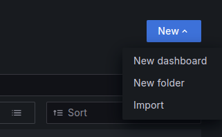

# BHF-Prometheus: A Student Project to Introduce Prometheus

## 1. Project Goal

This project is part of a student project and aims to help other students better understand Prometheus as a monitoring tool. It demonstrates how metrics from Go and Node.js applications can be collected and visualized through Grafana.

The main objectives of this project are:
- Installing and configuring Prometheus and Grafana in a Kubernetes cluster.
- Collecting and analyzing metrics from simple web APIs developed in Go and Node.js.
- Visualizing these metrics in Grafana dashboards to monitor and analyze web applications.

---

## 2. Architecture

The project consists of several components that communicate with each other to gather and visualize metrics:

- **Go Application**: A matrix multiplication API developed in Go that exports metrics for Prometheus.
- **Node.js Application**: A similar matrix calculation service built in Node.js that also exports Prometheus-compatible metrics.
- **Prometheus**: Monitors both applications and collects metrics from the provided endpoints.
- **Grafana**: Visualizes the collected metrics via pre-configured dashboards.
- **K6**: Used for load testing the APIs to monitor how they behave under stress.

### Communication Flow:
1. The Go and Node.js applications are deployed as pods in a Kubernetes cluster and expose their metrics via defined endpoints.
2. Prometheus scrapes these endpoints, collects metrics at set intervals, and stores them.
3. Grafana uses Prometheus as a data source to display the metrics in dashboards that show the performance and behavior of the applications.
4. K6 performs load tests, simulating various user loads to observe the performance of the applications under real-world conditions.

---

## 3. Use Cases

### Example 1: Monitoring CPU and Memory Usage
A typical scenario involves monitoring the CPU and memory usage of a web application. With the provided Prometheus metrics, you can observe these resources and identify bottlenecks early.

- **Go Application**: You can retrieve CPU and memory usage information via the `/metrics` endpoint of the Go application.
- **Node.js Application**: Similarly, the Node.js application provides metrics on memory usage and the number of active requests through the `/metrics` endpoint.

### Example 2: Load Testing with K6
Another scenario is subjecting the APIs to load testing using K6 to see how they handle increasing requests.

- **Test Setup**: Use the K6 script `response-react-test.js` to test both APIs in parallel with increasing loads.
- **Expected Outcome**: While the test is running, you can monitor the impact of the load on CPU and memory resources in real-time through Grafana and analyze how response times change under pressure.

## Requirements

To run this project, you need the following tools installed:

- [kubectl](https://kubernetes.io/docs/tasks/tools/): Kubernetes command-line tool.
- [minikube](https://minikube.sigs.k8s.io/docs/start/?arch=%2Flinux%2Fx86-64%2Fstable%2Fbinary+download): Tool for running Kubernetes locally.
- [helm](https://helm.sh/docs/intro/install/): Kubernetes package manager.
- [k6](https://grafana.com/docs/k6/latest/set-up/install-k6/): Load testing software, is not required
- [go](https://go.dev/doc/install): Only required for local testing of the Go application.
- [nodejs](https://nodejs.org/en/download/package-manager): Only required for local testing of the Node.js application.

## Deploying the Applications for Testing with Prometheus

### Go Matrix API

Navigate to the `application/go` folder to deploy the Go Matrix API. The following steps will guide you through building and deploying the Go application:

1. **Build the Docker Image:** 
    ```bash
    # Build the Go Docker image
    docker build -t go-matrix-api .
    ```
This command builds the Docker image for the Go Matrix API and tags it as `go-matrix-api`.

2. **Load the Image into Minikube:**
    ```bash
    # Then load the image into minikube context
    minikube image load go-matrix-api:latest
    ```
This command loads the Docker image into the Minikube environment so that it can be used in the Kubernetes cluster.

3. **Deploy the Application:**
    ```bash
    # Create a namespace for the application
    kubectl create namespace application 
    # Apply the deployment and service configurations
    kubectl apply -f deployment.yaml 
    ```

The above commands create a new namespace (if not already created) and deploy the Go application within the Kubernetes cluster.

**Endpoints**  
You can interact with the Go application using the following endpoints:

- To perform a matrix multiplication:

    ```bash
    curl http://localhost:3030/multiply?size=10
    ```

- To get metrics for Prometheus:

    ```bash
    curl http://localhost:3030/metrics
    ```

- To check the application status:

    ```bash
    curl http://localhost:3030
    ```

These endpoints allow you to interact with the application and monitor its performance. To access the application on the cluster, get the Minikube IP by using:

```bash
http://<minikube-ip>:<node-port>
```

You can find the port with the following command. You will see two ports: the first is the internal application port, and the second is the external port through which you can access the application:

```bash
kubectl get service -n application
```

### Node Matrix API

Navigate to the `application/nodejs` folder to deploy the Node.js Matrix API: Follow these steps:
1. **Build the Docker Image:**
```bash
# Build the Node.js Docker image
docker build -t node-matrix-api .
``` 
This command builds the Docker image for the Node.js Matrix API and tags it as node-matrix-api.

2. **Load the Image into Minikube:**
```bash
# Load the image into Minikube context
minikube image load node-matrix-api:latest
``` 
This command makes the Docker image available within the Minikube environment.
3. Deploy the Application:
```bash
# Create a namespace for the application (if not already created)
kubectl create namespace application 
# Apply the deployment and service configurations
kubectl apply -f deployment.yaml 
``` 
The above commands create the necessary namespace and deploy the Node.js application.

**Endpoints**

- To perform a matrix multiplication:
    ```bash
    curl http://localhost:3000/multiply\?size\=10
    ```
- To get metrics for Prometheus:
    ```bash
    curl http://localhost:3000/metrics
    ```
- To check the application status:
    ```bash
    curl http://localhost:3000
    ```

These endpoints allow you to interact with the application and monitor its performance. To access the application on the cluster, get the Minikube IP by using:

```bash
http://<minikube-ip>:<node-port>
```

You can find the port with the following command. You will see two ports: the first is the internal application port, and the second is the external port through which you can access the application:

```bash
kubectl get service -n application
```

> **Note:** If you make changes to the application code, you will need to:
> 
> - Remove the existing deployment and image from Minikube.
> - Reload the updated Docker image into Minikube.
> - Reapply the deployment file to update the Kubernetes cluster.

 ---

## Prometheus

This project uses Prometheus to collect metrics. Below are the steps for setting up Prometheus in your Minikube cluster:

- [Official repo](https://github.com/prometheus/prometheus?tab=readme-ov-file)
- [Helm repo](https://github.com/prometheus-community/helm-charts)

### Components Deployed by Prometheus Helm Chart

The `kube-prometheus-stack` Helm chart deploys a comprehensive set of components for monitoring Kubernetes clusters. Below are the primary components that are deployed:

#### 1. Prometheus Operator
Manages and automates the configuration of Prometheus instances, ensuring their proper deployment and ongoing operation.

#### 2. Prometheus
The core monitoring component that scrapes and collects metrics from applications and infrastructure. It uses custom resources like `PodMonitor` and `ServiceMonitor` to discover metrics endpoints.

#### 3. Alertmanager
Responsible for handling alerts generated by Prometheus, including grouping, deduplicating, and routing them to notification services such as email or Slack.

#### 4. Grafana
Provides dashboards for visualizing metrics collected by Prometheus. It comes pre-configured with useful dashboards for Kubernetes monitoring.

#### 5. Node Exporter
Collects metrics from the Kubernetes nodes, such as CPU, memory, disk, and other system metrics, which are essential for cluster health monitoring.

#### 6. Kube-State-Metrics
Provides detailed metrics related to the state of Kubernetes objects like deployments, nodes, and pods, which helps in understanding the health and performance of the Kubernetes cluster.

#### 7. Prometheus Windows Exporter (optional)
Used to collect metrics from Windows nodes.

---

The Helm chart deploys a full monitoring stack, including additional dependencies like Custom Resource Definitions (CRDs) that help configure and manage Prometheus, Grafana, and Alertmanager settings within the Kubernetes cluster. You can also customize the components via the `values.yaml` file, where components like `kube-state-metrics`, `node-exporter`, and `Grafana` can be enabled or disabled according to your needs.

For more information, please refer to the official GitHub page [here](https://github.com/prometheus-community/helm-charts).


### Installation

1. **Add the Prometheus Helm Repository:**
```bash
helm repo add prometheus-community https://prometheus-community.github.io/helm-charts
helm repo update
```
This command adds the Prometheus Helm chart repository and updates the list of available charts.

2. **Create a Namespace for Monitoring:**
```bash
kubectl create namespace monitoring
```
This command creates a new namespace called monitoring where Prometheus will be deployed.

3. **Install Prometheus using Helm:**
```bash
helm install prometheus prometheus-community/kube-prometheus-stack -n monitoring
```
This command installs Prometheus along with the necessary components in the monitoring namespace.

4. **Save Default Values for Customization:**
```bash
helm show values prometheus-community/kube-prometheus-stack > values.yaml
```
You can use this file (`values.yaml`) to customize the Prometheus deployment.

To access the Prometheus UI, you need to forward the Prometheus service port to your local machine:

### Port Forwarding for Prometheus
To access the Prometheus UI locally, use port forwarding:
```bash
kubectl port-forward service/prometheus-kube-prometheus-prometheus -n monitoring 8082:9090  
```
This command forwards port 9090 from the Prometheus service to your local port 8082, allowing you to access the Prometheus web interface.

### Apply Configuration Changes
If you modify the Prometheus configuration, follow these steps to apply the changes:

1. **Upgrade Prometheus with New Configuration:**
```bash
helm upgrade prometheus prometheus-community/kube-prometheus-stack -n monitoring -f ./values.yaml
```
This command upgrades the Prometheus deployment using the modified `values.yaml` file.

2. **Restart the Deployment to Apply Changes:**
```bash
kubectl rollout restart deployment prometheus-kube-prometheus-operator -n monitoring
```
This command restarts the Prometheus deployment to apply the new configuration.

### Accessing Prometheus

- **Get the Minikube IP:**
```bash
minikube ip
```
This command provides the IP address of your Minikube cluster.
- **Get the NodePort for Prometheus:**
```bash
kubectl get svc prometheus-server -n monitoring -o=jsonpath='{.spec.ports[0].nodePort}'
```
This command provides the NodePort that Prometheus is using.

- **Open the Prometheus UI:**
```bash
http://<minikube-ip>:<node-port>
```

Use the IP and NodePort obtained in the previous steps to access the Prometheus UI.


### Remove prometheus stack
```bash
helm list -A

# helm uninstall <name> -n <namespace>
helm uninstall prometheus -n monitoring
helm uninstall prometheus-operator -n monitoring
```

### Changes Made to `values.yaml`
I added custom scrape configurations to monitor the Go and Node.js Matrix API services in the Prometheus Helm chart. These changes allow Prometheus to scrape metrics from both services every second.

1. **Go Matrix Job:**
Added under `job_name: "go-matrix-job"`, targeting the Go application at `go-matrix-api-service.application:3030`.
2. **Node.js Matrix Job:**
Added under `job_name: "node-matrix-job"`, targeting the Node.js application at `node-matrix-api-service.application:3031`.

**Configuration**
```yaml
additionalScrapeConfigs:
    - job_name: "go-matrix-job"
    metrics_path: "/metrics"
    scrape_interval: 1s
    scheme: "http"
    static_configs:
        - targets: ["go-matrix-api-service.application:3030"]
    - job_name: "node-matrix-job"
    metrics_path: "/metrics"
    scrape_interval: 1s
    scheme: "http"
    static_configs:
        - targets: ["node-matrix-api-service.application:3031"]
```

These configurations enable Prometheus to collect metrics from both applications for monitoring.


### Note on Prometheus Configuration

Please note that the configuration file displayed under `status->config` in the Prometheus UI may not always reflect the actual configuration file in Prometheus. This discrepancy can occur if manual changes have been made to the Prometheus setup without updating the respective Helm values.


## Grafana

Grafana is included as part of the Prometheus Helm chart to help visualize metrics.

### Port Forwarding for Grafana
To access the Grafana UI locally:
```bash
kubectl port-forward service/prometheus-grafana -n monitoring 8081:80
```

This command forwards port 80 from the Grafana service to your local port 8081, allowing you to access Grafana at:

### Accessing Grafana

- **Username:** admin
- **Password:** prom-operator (You can also find this information in the values.yaml file)

### Import Grafana Dashboard
To import a Grafana dashboard using a JSON file, follow these steps:

1. Open Grafana: Go to your Grafana instance and log in.
2. Navigate to Dashboards: Click on the “new” icon in the left-hand menu and select “Import.”

3.  Use the file browser to locate `./grafana/go-metrics-dashboard.json` or `./grafana/node-metrics-dashboard.json`, to import the grafana dashboards.
4. Configure Settings: Set the necessary settings like the data source.
5. Import: Click “Import” to finalize and view the dashboard.

## K6 Load Testing

Run a Load Test: Use k6 to test the performance of your APIs. Example:
```bash
k6 run ./k6/response-react-test.js
```

## Sources

[Github Repo](https://github.com/kev5655/bfh-prometheus)

**Main Sources**
- [Prometheus Configurations](https://prometheus.io/docs/prometheus/latest/configuration/configuration/)
- [Prometheus Helm Chart](https://github.com/prometheus-community/helm-charts)
- [Youtube Guid K8s and Prometheus](https://www.youtube.com/watch?v=6xmWr7p5TE0&t=2747s)
- [Youtube Prometheus Overview](https://www.youtube.com/watch?v=h4Sl21AKiDg)

**Additional Sources**
- [Kubernetes Docs](https://kubernetes.io/docs/home/)
- [Helm Docs](https://helm.sh/docs/)
- [Grafana Docs](https://grafana.com/docs/grafana/latest/)
- [K6 Loadtesting](https://grafana.com/docs/k6/latest/)